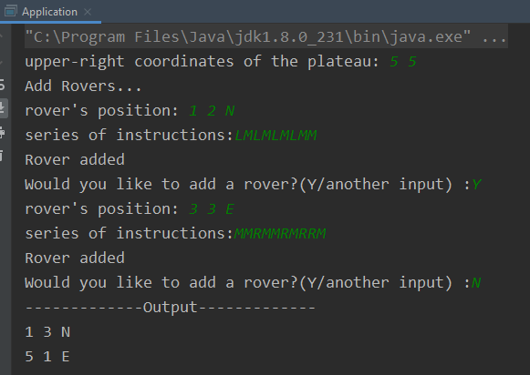
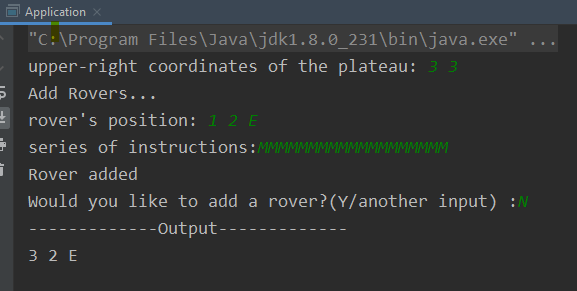
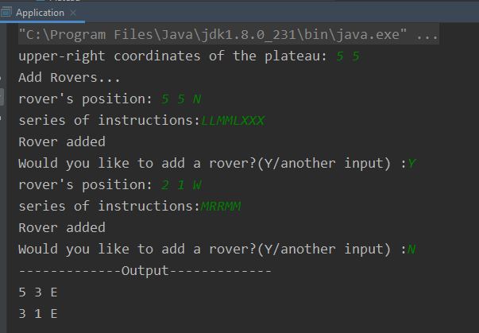

## Mars Rover Projesi
Template Method ve Factory tasarım kalıpları kullanılarak tasarım yapıldı.

#### Uygulama Paketleri
* ***base***    →  __Uygulamada kullanılan yardımcı sınıflar bulunur.__
    * ***Constants*** → Uygulamada  kullanılan sabit değişkenler bulunur.
    * ***Utils***     → Uygulamada validasyon için kullanılan metotlar bulunur.
* ***domain***    →  __Uygulamanın sorumluluklarını yerine getiren ana sınıflar bulunur.__
  * ***Instruction*** →  __Gelen komutlarla ilgili alınması gereken aksiyonların yazıldığı sınıflar bulunur. Oop soyutlama özelliği kullanılarak kod tekrarı önlendi. ilerde herhangi bir alt sınıfta olan değişikliğin etkisi sadece o sınıfı etki edecek şekilde ayrıştırıldı.__
  * ***Map***  → Plato'daki harita bilgisini tutar. Oluşturulan yeni konumun  geçerli olup/olmadğı kontrolu yapar.
  * ***Plateau*** →  Plato nesnesinin oluşturulmasından sorumlu sınıf.
  * ***Position*** →  İzcinin konum bilgisini tutan sınıftır.
  * ***Rover*** → Platoda gezecek izciye karşılık gelir. gelen komut bilgisinide üzerinde tutar. 
  
  
  #### Örnek Çıktılar
  
Gönderilen ödevdeki cıktı

 
 
Geçersiz konumda ilerlemeyen örnek

 
  
Geçersiz komutta ilerlemeyen örnek
  
   
